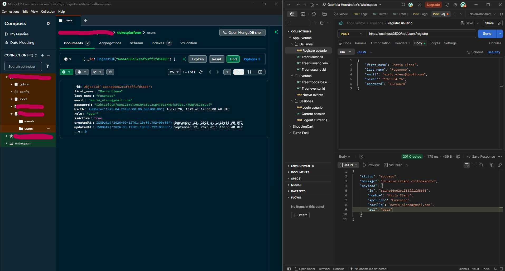

<h1 align="center">Esto es Eventeala 🎫</h1>
<h2 align="center">Una API para gestión de eventos (WIP) orientada a talleres y charlas educativas</h2>

<h3 align="center">Información técnica del proyecto</h3>
<h4>🧱 Stack</h4>
Node.js (usando ESM) con las siguientes dependencias:
<ul>
<li>Express</li>
<li>Mongoose</li>
<li>bcrypt</li>
<li>dotenv</li>
</ul>

<h5>🏢 Arquitectura</h5>
La API sigue una arquitectura en capas con separación de responsabilidades:
<ul>
<li>Enrutadores: Definen los endpoints y dirigen las solicitudes.</li>
<li>Controladores: Manejan el flujo de la petición HTTP, validan la entrada y envían la respuesta en formato JSON.</li>
<li>Servicios: Contienen la lógica de negocio y las reglas de la aplicación.</li>
<li>DAOs: Gestionan el acceso y la persistencia de datos (persistencia desacoplada).</li>
<li>Modelos: Definen los esquemas y estructuras de los datos.</li>
</ul>
<h5>🌲 Árbol de directorios</h5>
├── src/ 
│   ├── app.js 
│   ├── server.js 
│   ├── config/ 
│   ├── controllers/ 
│   ├── constatnts/ 
│   ├── dao/ 
│   ├── helpers/ 
│   ├── middlewares/ 
│   ├── models/ 
│   ├── repositories/ 
│   ├── routes/ 
│   ├── services/ 
│   └── utils/ 
├── .env.example 
├── .gitignore 
├── package.json 
└── README.md 

<h5>🪸 Variables de entorno</h5>
<strong>PORT:</strong> Puerto en el que escucha el servidor (ej: 8080) 
<strong>NODE_ENV:</strong> Entorno de ejecución (development, production) 
<strong>USER_DUMMY:</strong> nombre de usuario dummy en esta primera etapa hasta que comencemos a usar autenticacion de usuarios. 
<strong>SECRET_DUMMY:</strong> password de usuario dummy en esta primera etapa hasta que comencemos a usar autenticacion de usuarios. 
<strong>MONGO_URI:</strong> URI de conexión a la base de datos MongoDB ( ej: mongodb://localhost:27017/eventos ) 
<strong>DB_NAME:</strong> Nombre de la base de datos en MongoDB (ej: "mibase") 

<h5>👩🏻‍💻 Instalación y Ejecución</h5>
<ol>
<li>Clonar el repositorio: 
<code>git clone &lt URL_DE_TU_REPOSITORIO &gt</code>
<code>cd &lt nombre-carpeta &gt</code>
</li>
<li>Instalar dependencias: 
<code>npm install [dependencie]</code>
</li>
<li>Configurar el entorno: 
<code>cp .env.example .env</code>
</li>
<li>Ejecutar en modo desarrollo: 
<code>npm run dev</code>
</li>
</ol>

<h5>📍 Rutas Disponibles (Endpoints)</h5>
<h6>GET /api/health</h6>
<ul>
<li>Muestra el estado del servidor</li>
<li>Ejemplo: </li>
<li>Respuesta esperada: <code>({ "status": "200", "message": "Servidor OK" })</code></li>
</ul>

<h6>GET /api/events</h6>
<ul>
<li>Muestra el listado completo de eventos</li>
<li>Ejemplo:</li>
<li>Respuesta esperada: <code>({ "status": "success", "payload": [] })</code></li>
</ul>

<h6>GET /api/events/:id</h6>
<ul>
<li>Trae un evento filtrado por su id de MongoDB</li>
<li>Ejemplo:</li>
<li>Respuesta esperada: <code>({ "status": "success", "payload": [] })</code></li>
</ul>

<h6>POST /api/events</h6>
<ul>
<li>Crea un nuevo evento</li>
<li>Ejemplo: localhost:3500/api/events</li>
<li>Datos: {
    "code": "",
"title": "",
"description": "",
"location": "",
"category": "",
"artist": "",
"date": "yyyy-mm-ddThh:mm:ssZ",
"startTime": "hh:mm",
"endTime": "hh:ss",
"price": ,
"totalTickets": ,
}</li>
<li>Respuesta esperada: <code>({ "status": "success", "payload": [] })</code></li>
</ul>

<h6>GET /api/users</h6>
<ul>
<li>Muestra el listado completo de usuarios</li>
<li>Ejemplo: </li>
<li>Respuesta esperada: <code>({ "status": "success", "payload": [] })</code></li>
</ul>

<h6>GET /api/users/email/:email</h6>
<ul>
<li>Filtra un usuario por su email</li>
<li>Ejemplo: localhost:3000/api/users/email/jorge@gmail.com</li>
<li>Respuesta esperada: <code>({ "status": "success", "payload": [] })</code></li>
</ul>

<h6>GET /api/users/email/:id</h6>
<ul>
<li>Filtra un usuario por su id de MongoDB</li>
<li>Ejemplo: localhost:3000/api/users/6a9c22222222274084b56a4</li>
<li>Respuesta esperada: <code>({ "status": "success", "payload": [] })</code></li>
</ul>

<h6>POST /api/users/register</h6>
<ul>
<li>Crea un nuevo usuario</li>
<li>Ejemplo: localhost:3000/api/users/register</li>
<li>Datos: {
    "first_name": "",
    "last_name": "",
    "email": "",
    "birth": "yyyy-mm-dd",
    "password": "12345678"
}</li>
<li>Respuesta esperada: <code>({ "status": "success", "message": "Usuario creado exitosamente", "payload": [] })</code></li>
</ul>

<h6>POST /api/sessions/login</h6>
<ul>
<li>Login de usuario</li>
<li>Ejemplo: localhost:3000/api/sessions/login</li>
<li>Datos: {
    "email": "",
    "password": ""
}</li>
<li>Respuesta esperada <code>({ "status": "success", "message": "Bienvenido $first_name $last_name", "payload": [] })</code></li>
</ul>

<ul>
<h6>GET /api/sessions/current</h6>
<li>Muestra la sesión activa</li>
<li>Ejemplo: localhost:3000/api/sessions/current</li>
<li>Respuesta esperada: <code>({ "status": "success", "message": "Detalles de la sesión activa", "payload": [] })</code></li>
</ul>

<h6>POST /api/sessions/logout</h6>
<ul>
<li>Cierra la sesión activa</li>
<li>Ejemplo: localhost:3000/api/sessions/logout</li>
<li>Respuesta esperada: <code>({ "status": "success", "message": "Gracias por visitarnos." })</code></li>
</ul>

<h5>👩🏻‍💻 Sobre mi </h5>
- Me llamo Gabriela, soy de Argentina y este proyecto corresponde a una práctica para mi curso de Backend II en Coderhouse.
- 📫 Podés encontrarme en **gabienelmundo@gmail.com**

//TODO: actualizar directorio carpetas con tests y aclarar cuales son. actualizar dependencias con espress - sessions

<h2>Screenshots</h2>

  

